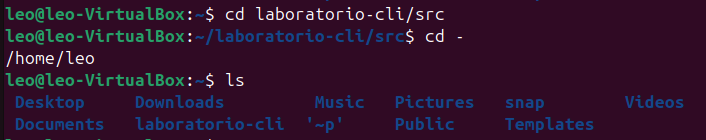
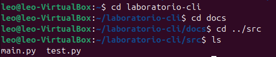
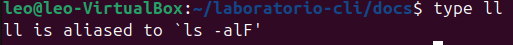
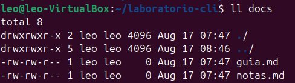
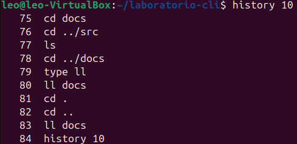
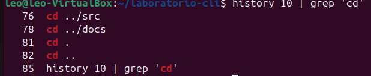
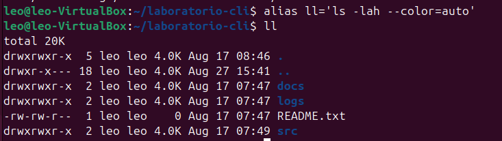
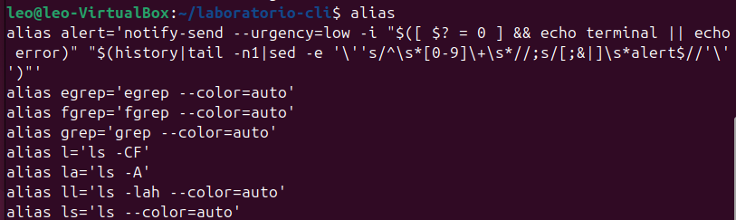
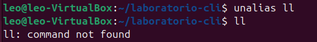

# Explicación de Comandos de Terminal

A continuación se detalla paso a paso lo que hace cada comando mostrado en las capturas de pantalla proporcionadas:

## Captura 1

- **`cd laboratorio-cli/src`**: Cambia el directorio actual, navegando directamente hacia la ruta `laboratorio-cli/src`.
- **`cd -`**: Regresa al directorio de trabajo en el que estabas inmediatamente antes del último cambio (en este caso, vuelve a `/home/leo`).
- **`ls`**: Lista los archivos y carpetas del directorio actual.

## Captura 2

- **`cd laboratorio-cli`** y **`cd docs`**: Navegan paso a paso dentro de los directorios.
- **`cd ../src`**: Sube un nivel en la jerarquía de directorios (usando `..` para salir de `docs`) y entra directamente a la carpeta `src`.
- **`ls`**: Lista el contenido del directorio actual (`src`), mostrando los archivos `main.py` y `test.py`.

## Captura 3

- **`type ll`**: Sirve para saber qué tipo de comando es `ll`. La salida indica que `ll` no es un comando integrado del sistema, sino un **alias** configurado para ejecutar `ls -alF`.

## Captura 4

- **`ll docs`**: Ejecuta el alias `ll` apuntando al directorio `docs`. Esto muestra una lista detallada de los elementos dentro de la carpeta, incluyendo permisos, número de enlaces, propietario, grupo, tamaño en bytes, fecha de última modificación, y archivos ocultos.

## Captura 5

- **`history 10`**: Muestra en la pantalla el historial de los últimos 10 comandos que se han ejecutado en esa sesión de la terminal, numerados por su orden de ejecución.

## Captura 6

- **`history 10 | grep 'cd'`**: Utiliza una tubería o *pipe* (`|`) para conectar dos comandos. Toma la salida de los últimos 10 comandos (`history 10`) y se la pasa a `grep`, el cual filtra y muestra únicamente aquellas líneas que contienen la cadena de texto **'cd'**.

## Captura 7

- **`alias ll='ls -lah --color=auto'`**: Define o sobrescribe el alias `ll`. A partir de ese momento, al escribir `ll` se ejecutará `ls` con los parámetros: lista detallada (`-l`), incluir archivos ocultos (`-a`), mostrar el peso de los archivos en un formato legible por humanos como Kilobytes o Megabytes (`-h`), y colorear la salida.
- **`ll`**: Ejecuta el nuevo alias para listar el contenido del directorio actual de forma detallada.

## Captura 8

- **`alias`**: Al ejecutar este comando sin ningún argumento, imprime en pantalla una lista de todos los alias que están definidos y activos actualmente en el entorno de la terminal.

## Captura 9

- **`unalias ll`**: Elimina por completo el alias `ll` que estaba configurado en la sesión.
- **`ll`**: Al intentar ejecutarlo nuevamente, el sistema devuelve `command not found` (comando no encontrado), lo que confirma que el alias fue borrado exitosamente.
